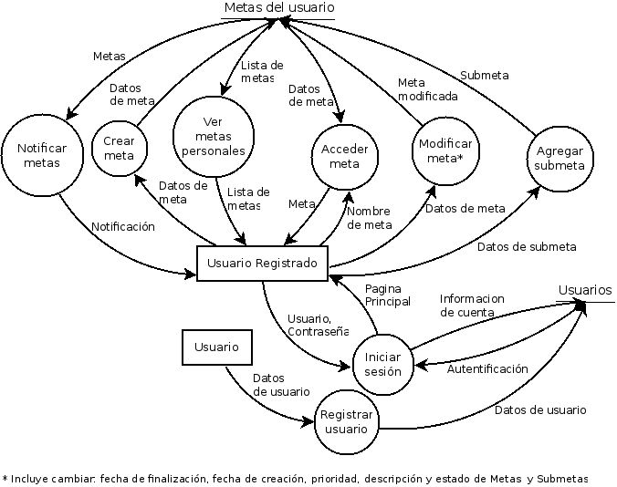

#### Goal Set Tracker

## Acerca de 

El Goal Set Tracker es un sistema para poder controlar metas personales.
El sistema posee una plataforma de autentificación para poder loguearse y hacer uso del mismo. 
Al usuario solo se le permiten ver sus metas personales.
Las metas podran tener sub-metas y se permitirá poder ponerle una fechas de caducidad. 
Cada meta y sub-metas contará con 3 estados posibles: Propuesta, En progreso, Finalizada. 
En cada meta y sub-metas se podrá comentar y añadir archivos adjuntos.
Cada meta posee un porcentaje de completitud, que depende de las sub-metas.
Las metas y sub-metas podran ser asignadas a categorias creadas por el usuario.
El usuario solo podra acceder a sus categorias personales.
El sistema cuenta con un sistema de alerta para indicarle al usuario que una meta está por vencer y en el caso que se venció y no fue lograda se notifique al usuario para que revea las metas vencidas y un sistema de filtrado de metas.

# DFD

# Diagrama de clases

## Requerimientos para poder usar la aplicacion

django
django-allauth

##Para empezar a usar la aplicacion:
Migrar los models para crear las tablas en la base de datos
- python manage.py makemigrations "login" "goal" "commentary" "category" "upload" "notifications"
- python manage.py migrate

y luego precargar la configuración para registrarse con redes sociales:
- python manage.py loaddata social-config.json

Una forma alternativa para hacer todo esto junto es utilizar el Makefile con el comando "update_models" de la forma:
- make update_models

## Bugs conocidos

- Al crear un usuario el cual posea un nombre con espacio la aplicacion no pude generar el home.

# Colaboradores

-Francisco Nievas
-Luciano Rodriguez
-Diego Lupi
-Nicolas Sabbatini
