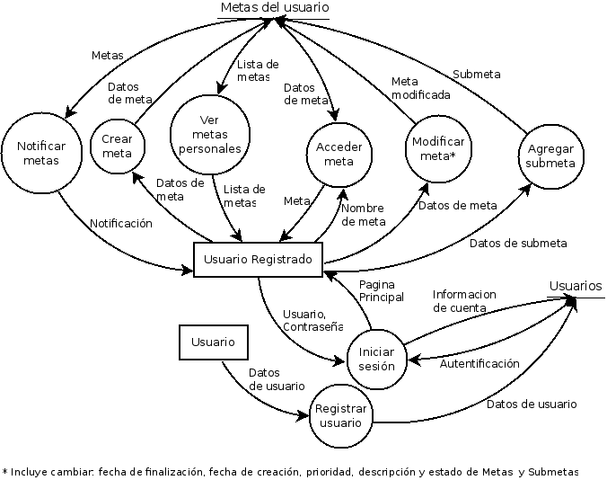

#### Descripción del alcance

Sistema para poder controlar metas personales. El sistema debe permitir una plataforma de autentificación para poder loguearse y hacer uso del sistema. Al usuario solo se le permitirá ver sus metas personales.
Las metas podran tener sub-metas y se permitirá poder ponerle fechas de caducidad a c/u de las metas. Cada meta contará con 3 estados posibles: Propuesta, En progreso, Finalizada. En cada Meta y Submeta se podrá comentar y añadir archivos adjuntos.
El sistema contará con un sistema de alerta para indicarle al usuario que una meta está por vencer y en el caso que se venció y no fue lograda se notifique al usuario para que revea las metas vencidas.

#### DFD

#### Casos de uso

* Caso de uso 1: Añadir Meta
* Actor primario: Usuario
* Precondición: El Usuario esta logueado en el sistema.
* Escenario existoso principal:
    1. El Usuario selecciona la opción para crear una nueva meta.
    2. El sistema abre la interfaz de creación de metas.
    3. El Usuario ingresa la descripción y fecha límite de la meta y sub-metas si quisiese.
* Escenario excepcionales:
    3. a) La fecha ya pasó.
        * El sistema avisa al Usuario que la fecha ya caducó.

* Caso de uso 2: Finalizar meta
* Actor primario: Usuario
* Precondición: El Usuario esta logueado en el sistema y posee al menos una meta activa
* Escenario existoso principal:
    1. El usuario selecciona la meta que desea marcar como finalizada y selecciona la opción para finalizarla.
    2. El sistema le notifica al Usuario que la meta finalizó.
* Escenario excepcionales:

* Caso de uso 3: Notificar vencimiento de Meta
* Actor primario: Sistema
* Precondición: Usuario con al menos una meta que esté por vencer
* Escenario existoso principal:
    1. El sistema envia una notificación al Usuario.
    2. El Usuario selecciona si quiere posponer la notificación o si quiere que no le notifiquen de nuevo.
* Escenario excepcionales:

* Caso de uso 4: Login Usuario
* Actor primario: Usuario
* Precondición: El usuario posee una cuenta
* Escenario existoso principal:
    1. El Usuario ingresa su usuario y contraseña.
    2. El sistema muestra la pantalla principal de la aplicación.
* Escenario excepcionales:
    1. a) El usuario ingresa mal su usuario y/o contraseña.
        * El sistema le informa al usuario la situación y le pide que reingrese su usuario y contraseña.

* Caso de uso 5: Modificar meta
* Actor primario: Usuario
* Precondición: El Usuario esta logueado en el sistema y posee al menos una meta.
* Escenario existoso principal:
    1. El usuario selecciona la meta que desea modificar.
    2. El sistema le notifica al Usuario que la meta finalizó.
* Escenario excepcionales:

* Caso de uso 6: Adherir Archivo a la meta
* Actor primario : Usuario
* Precondición: El Usuario esta logueado en el sistema.
* Escenario exitoso principal:
	1. El usuario selecciona la meta que desea agregar un archivo.
	2. El sistema ingresa a la meta seleccionada.
	3. El usuario hace click en el boton(Add File).
	4. El sistema abre un formulario para llenar con las caracteristicas.
	5. El usuario llena los campos correspondientes y hace clink en el boton(Save).
	6. El sistema agrega el archivo y redirecciona al usuario a la meta.
* Escenarios excepcionales:
	5. a) El usuario quiere agregar un archivo que ya existe en la meta
		* El sistema informa que "Este archivo ya se encuenta en esta meta"

* Caso de uso 7: Adherir URL de archivo extraido del navegador
* Actor primario : Usuario
* Precondición: El Usuario esta logueado en el sistema.
* Escenario exitoso principal:
	1. El usuario selecciona la meta que desea agregar un archivo.
	2. El sistema ingresa a la meta seleccionada.
	3. El usuario hace click en el boton(Add File).
	4. El sistema abre un formulario para llenar con las caracteristicas.
	5. El usuario llena los campos correspondientes y hace clink en el boton(Save).
	6. El sistema agrega el archivo y redirecciona al usuario a la meta.
* Escenarios excepcionales:
	5. a) El usuario ingresa una URL no valida
		* El sistema informa que "Url no valida"
	5. b) El usuario ingresa el url y un archivo del disco o no ingresa ninguno
		* El sistema informa que "Debe tener url o archivo"

* Caso de uso 8: Adherir Archivo a la submeta
* Actor primario : Usuario
* Precondición: El Usuario esta logueado en el sistema y estar en dentro de la meta.
* Escenario exitoso principal:
	1. El usuario selecciona la submeta que desea agregar un archivo.
	2. El sistema ingresa a la submeta seleccionada.
	3. El usuario hace click en el boton(Add File).
	4. El sistema abre un formulario para llenar con las caracteristicas.
	5. El usuario llena los campos correspondientes y hace clink en el boton(Save).
	6. El sistema agrega el archivo y redirecciona al usuario a la submeta.
* Escenarios excepcionales:
	5. a) El usuario quiere agregar un archivo que ya existe en la submeta
		* El sistema informa que "Este archivo ya se encuenta en esta meta"

* Caso de uso 9: Adherir URL de archivo extraido del navegador
* Actor primario : Usuario
* Precondición: El Usuario esta logueado en el sistema y estar en dentro de la meta padre.
* Escenario exitoso principal:
	1. El usuario selecciona la submeta que desea agregar un archivo.
	2. El sistema ingresa a la submeta seleccionada.
	3. El usuario hace click en el boton(Add File).
	4. El sistema abre un formulario para llenar con las caracteristicas.
	5. El usuario llena los campos correspondientes y hace clink en el boton(Save).
	6. El sistema agrega el archivo y redirecciona al usuario a la meta.
* Escenarios excepcionales:
	5. a) El usuario ingresa una URL no valida
		* El sistema informa que "Url no valida"
	5. b) El usuario ingresa el url y un archivo del disco o no ingresa ninguno
		* El sistema informa que "Debe tener url o archivo"

* Caso de uso 10: Ver lista de archivos de una meta
* Actor primario : Usuario
* Precondición: El Usuario esta logueado en el sistema.
* Escenario exitoso principal:
	1. El usuario selecciona la meta que desea ver los archivos.
	2. El sistema ingresa a la meta seleccionada.
	3. El usuario hace click en el boton(File List).
	4. El sistema abre una lista con todos los Archivos y URLs de dicha meta.
* Escenarios excepcionales:
	5. a) 
		* El sistema informa que "No hay archivos adjuntos a la meta"

* Caso de uso 11: Ver lista de archivos de una submeta
* Actor primario : Usuario
* Precondición: El Usuario esta logueado en el sistema y estar dentro de meta padre.
* Escenario exitoso principal:
	1. El usuario selecciona la submeta que desea ver los archivos.
	2. El sistema ingresa a la submeta seleccionada.
	3. El usuario hace click en el boton(File List).
	4. El sistema abre una lista con todos los Archivos y URLs de dicha submeta.
* Escenarios excepcionales:
	5. a) 
		* El sistema informa que "No hay archivos adjuntos a la submeta"

* Caso de uso 12: Editar archivo de una meta
* Actor primario : Usuario
* Precondición: El Usuario esta logueado en el sistema.
* Escenario exitoso principal:
	1. El usuario selecciona la meta que contiene el archivo a modificar.
	2. El sistema ingresa a la meta seleccionada.
	3. El usuario hace click en el boton(File List).
	4. El sistema abre una lista con todos los Archivos y URLs de dicha meta.
	5. El usuario hace click en editar del archivo que quiere editar.
	6. El Sistema redirecciona al formulario con los campos llenos.
	7. El usuario modifica el archivo la meta y hace click en el boton(Save).
	8. El sistema modifica dicho archivo y lo redirecciona a la meta.
* Escenarios excepcionales:
	7. a) El usuario llena mal los campos. 
		* El sistema informa que "Debe tener url o archivo" o "Este archivo ya se encuenta en esta meta"
			o "Url no valida"

* Caso de uso 13: Editar archivo de una submeta
* Actor primario : Usuario
* Precondición: El Usuario esta logueado en el sistema y estar dentro de meta padre.
* Escenario exitoso principal:
	1. El usuario selecciona la submeta que desea ver los archivos.
	2. El sistema ingresa a la submeta seleccionada.
	3. El usuario hace click en el boton(File List).
	4. El sistema abre una lista con todos los Archivos y URLs de dicha submeta.
	5. El usuario hace click en editar del archivo que quiere editar.
	6. El Sistema redirecciona al formulario con los campos llenos.
	7. El usuario modifica el archivo la submeta y hace click en el boton(Save).
	8. El sistema modifica dicho archivo y lo redirecciona a la submeta.
* Escenarios excepcionales:
	7. a) El usuario llena mal los campos. 
		* El sistema informa que "Debe tener url o archivo" o "Este archivo ya se encuenta en esta meta"
			o "Url no valida"

* Caso de uso 14: Eliminar archivo de una meta
* Actor primario : Usuario
* Precondición: El Usuario esta logueado en el sistema.
* Escenario exitoso principal:
	1. El usuario selecciona la meta que contiene el archivo a eliminar.
	2. El sistema ingresa a la meta seleccionada.
	3. El usuario hace click en el boton(File List).
	4. El sistema abre una lista con todos los Archivos y URLs de dicha meta.
	5. El usuario hace click en eliminar del archivo que quiere editar.
	6. El sistema modifica dicho archivo y lo redirecciona a la meta.
* Escenarios excepcionales:
	4. a) 
		* El sistema informa que "No hay archivos adjuntos a la meta"

* Caso de uso 15: Eliminar archivo de una meta
* Actor primario : Usuario
* Precondición: El Usuario esta logueado en el sistema estar dentro de meta padre.
* Escenario exitoso principal:
	1. El usuario selecciona la submeta que contiene el archivo a eliminar.
	2. El sistema ingresa a la submeta seleccionada.
	3. El usuario hace click en el boton(File List).
	4. El sistema abre una lista con todos los Archivos y URLs de dicha submeta.
	5. El usuario hace click en eliminar del archivo que quiere editar.
	6. El sistema modifica dicho archivo y lo redirecciona a la submeta.
* Escenarios excepcionales:
	4. a) 
		* El sistema informa que "No hay archivos adjuntos a la submeta"

* Caso de uso 16: Abrir archivo de una meta
* Actor primario : Usuario
* Precondición: El Usuario esta logueado en el sistema.
* Escenario exitoso principal:
	1. El usuario selecciona la meta que contiene el archivo a abrir.
	2. El sistema ingresa a la meta seleccionada.
	3. El usuario hace click en el boton(File List).
	4. El sistema abre una lista con todos los Archivos y URLs de dicha meta.
	5. El usuario hace click en el archivo.
	6. El sistema abre el archivo.
* Escenarios excepcionales:
	4. a) 
		* El sistema informa que "No hay archivos adjuntos a la meta"
	6. b) El usuario copia el path y se deslogea y quiere abrirlo en otro pestaña
		* El sistema informa "Sorry you don't have permission to access this file"

* Caso de uso 17: Abrir archivo del navegador una meta
* Actor primario : Usuario
* Precondición: El Usuario esta logueado en el sistema.
* Escenario exitoso principal:
	1. El usuario selecciona la meta que contiene el archivo a ver.
	2. El sistema ingresa a la meta seleccionada.
	3. El usuario hace click en el boton(File List).
	4. El sistema abre una lista con todos los Archivos y URLs de dicha meta.
	5. El usuario hace click en la URL.
	6. El sistema redirecciona a la URL.
* Escenarios excepcionales:

* Caso de uso 18: Abrir archivo de una submeta
* Actor primario : Usuario
* Precondición: El Usuario esta logueado en el sistema y estar dentro de la meta padre.
* Escenario exitoso principal:
	1. El usuario selecciona la submeta que contiene el archivo a abrir.
	2. El sistema ingresa a la meta seleccionada.
	3. El usuario hace click en el boton(File List).
	4. El sistema abre una lista con todos los Archivos y URLs de dicha meta.
	5. El usuario hace click en el archivo.
	6. El sistema abre el archivo.
* Escenarios excepcionales:
	4. a) 
		* El sistema informa que "No hay archivos adjuntos a la submeta"
	6. b) El usuario copia el path y se deslogea y quiere abrirlo en otro pestaña
		* El sistema informa "Sorry you don't have permission to access this file"

* Caso de uso 19: Abrir archivo del navegador una submeta
* Actor primario : Usuario
* Precondición: El Usuario esta logueado en el sistema y estar dentro de meta padre.
* Escenario exitoso principal:
	1. El usuario selecciona la submeta que contiene el archivo a ver.
	2. El sistema ingresa a la submeta seleccionada.
	3. El usuario hace click en el boton(File List).
	4. El sistema abre una lista con todos los Archivos y URLs de dicha submeta.
	5. El usuario hace click en la URL.
	6. El sistema redirecciona a la URL.
* Escenarios excepcionales:

----

Casos de uso

1- registrar usuario
2- loguear usuario
3- agregar descripción a meta
4- crear meta
5- alargar plazo de la meta
6- darle prioridad alta meta
7 – darle prioridad media a la meta
8 – darle prioridad baja a la meta
9 – darle prioridad alta a la submeta
10 – darle prioridad media a la submeta
11 – darle prioridad baja a la submeta
12 - modificar meta
13 - crear submeta
14 - comentar meta
15 - comentar submeta
16 - crear categoría
17 - ver notificaciones
18 – agregar foto a la meta
19 – agregar archivo a la meta
20 – agregar foto a la submeta
21 – agregar archivo a la submeta
22 – eliminar archivo de la meta
23 – eliminar foto de la meta
24 – eliminar archivo de la submeta
25 – eliminar archivo de la submeta
26 – ver metas finalizadas
27 – ver meta
28 – ver submeta
29 – poner en proceso meta
30 – poner en proceso submeta
31 – dar de baja meta
32- dar de baja submeta
33 – finalizar meta
34 – finalizar submeta
35 – dar de baja a categoría
36 – darle plazo a submeta
37- alargar el plazo a submeta
38 – eliminar comentario de la meta
39 – eliminar comentario de la submeta
40 – eliminar meta
41 – eliminar submeta
42 - alargar plazo de la submeta
43 – ver metas en proceso
44 – ver metas en espera
43 – ver submeta en proceso
44 – ver submeta en espera
45 – ver submetas finalizadas
46 – modificar submeta
47 -  ver notificaciones de una meta
48 -  ver notificaciones de una submeta
49 -  agregar descripción a submeta
50 – eliminar categoría
51 -  crear nick
52 – modificar nick
53 – agregar mail
54 – ver fotos de una meta
55 – ver archivos de una meta
56 – ver fotos de una submeta
57 – ver archivos de una submeta
58 – compartir las metas cumplidas
59 – compartir las metas en proceso
60 – compartir las metas propuestas
